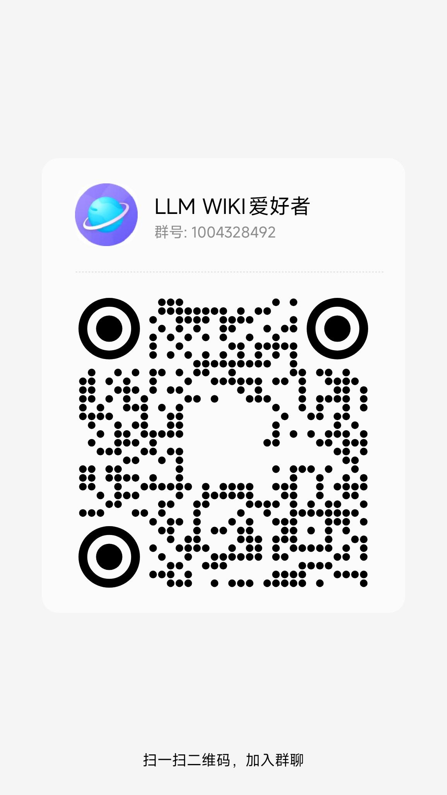

# 奈姆希（Nemsy）：一个自我构建的私人知识助理

> 名字取自炉石传说中的 Nemsy Necrofizzle —— 聪明、好奇、充满能量。

本项目基于 Karpathy 的 LLM Wiki 理念，由 DeepSeek 超长上下文模型驱动，以 Obsidian Vault 为知识源，为唯一用户提供持续积累、自主归纳的个人知识服务。

---


## 目录结构

```
Nemsy/
├── src/nemsy/
│   ├── __init__.py
│   ├── cli.py          # CLI 入口（click + rich）
│   ├── agent.py        # Agent 核心：ingest / query / lint / chat / save
│   ├── vault.py        # Obsidian Vault 读写操作
│   ├── llm.py          # DeepSeek API 封装（流式 / 普通 / 推理）
│   └── config.py       # 统一配置加载（.env + settings.toml）
├── config/
│   └── settings.toml   # 项目配置（Vault 路径、模型、CLI 等）
├── tests/
├── .catpaw/
│   └── rules           # Vibe coding 规则（AI 协作约定）
├── .env                # 密钥（不进 git）
├── .env.example        # 密钥模板
└── pyproject.toml      # 包配置与依赖管理
```

Obsidian Vault 内由 Nemsy 管理的目录：

```
Obsidian Vault/
├── nemsy-wiki/             # Wiki 层（由 LLM 写，你来读）
│   ├── index.md            # 内容索引（自动维护）
│   ├── log.md              # 操作日志（仅追加）
│   ├── sources/            # 摄取资料的摘要页面
│   ├── insights/           # /save 命令归档的对话洞见
│   ├── queries/            # 有价值的查询结果归档
│   ├── entities/           # 实体页面（人物、项目、工具）
│   └── concepts/           # 概念页面（理论、方法论）
└── origin-sources/         # 原始资料层（只读，你来维护）
    ├── 某个主题/
    │   ├── _index.md       # 摄取指导（可选，告诉 LLM 如何处理本目录）
    │   └── 文章.md
    └── ...
```

---

## 安装准备

在开始部署之前，请确认以下工具和账号均已就绪：

| 类别 | 要求 | 说明 |
|------|------|------|
| **Python** | 3.11 或更高版本 | [python.org](https://www.python.org/downloads/) 下载安装包，Windows 安装时勾选 **Add Python to PATH** |
| **Git** | 任意版本 | [git-scm.com](https://git-scm.com/) 下载，用于克隆项目 |
| **Obsidian** | 任意版本 | [obsidian.md](https://obsidian.md/) 下载，需提前创建好一个 Vault（本地目录即可）|
| **DeepSeek API Key** | 有效 Key | 前往 [platform.deepseek.com](https://platform.deepseek.com/) 注册并创建 API Key，保存备用 |
| **网络** | 可访问 DeepSeek API | 每次 ingest、query、chat 都会调用 DeepSeek API，需确保网络畅通 |

> **关于 Obsidian Vault：** Vault 是 Obsidian 管理的本地文件夹，Nemsy 会在其中创建 `nemsy-wiki/` 子目录用于存放 Wiki。Vault 可以放在本地磁盘、iCloud 或 OneDrive 同步目录下，路径后续填入 `config/settings.toml`。

> **关于原始资料：** Nemsy 从你指定的原始资料目录（`origin-sources/`）读取 Markdown 文件进行摄取。你只需把想整理的文章、笔记放进该目录，Nemsy 会自动处理，无需手动编辑格式。

---

## 部署

**前置要求：** Python 3.11+、DeepSeek API Key

---

### macOS

**1. 克隆项目**

```bash
git clone <repo-url>
cd Nemsy
```

**2. 创建虚拟环境**

```bash
python -m venv .venv
source .venv/bin/activate
```

**3. 安装依赖**

```bash
pip install -e ".[dev]"
```

**4. 配置密钥**

```bash
cp .env.example .env
# 用文本编辑器打开 .env，填入：
# DEEPSEEK_API_KEY=sk-xxxxxxxxxxxxxxxx
```

**5. 配置 Vault 路径**

编辑 `config/settings.toml`，修改 `[vault]` 下的 `path` 为你的 Obsidian Vault 路径：

```toml
[vault]
path = "/Users/你的用户名/path/to/Obsidian Vault"
raw_sources_dir = "origin-sources"   # 原始资料子目录名
```

**6. 磁盘访问权限（Vault 在 iCloud / OneDrive 时必须）**

> 系统设置 → 隐私与安全性 → 完全磁盘访问权限 → 添加终端应用并开启

**7. 验证配置**

```bash
nemsy status
```

---

### Windows

**1. 前置环境确认**

- 安装 [Python 3.11+](https://www.python.org/downloads/)（安装时勾选 **Add Python to PATH**）
- 推荐使用 **PowerShell** 或 **Windows Terminal** 操作

**2. 克隆项目**

```powershell
git clone <repo-url>
cd Nemsy
```

**3. 创建虚拟环境**

```powershell
python -m venv .venv
.venv\Scripts\activate
```

> 若提示"无法加载脚本"，以管理员身份运行 PowerShell，执行一次：
> ```powershell
> Set-ExecutionPolicy RemoteSigned
> ```

**4. 安装依赖**

```powershell
pip install -e ".[dev]"
```

**5. 配置密钥**

在项目根目录新建 `.env` 文件（可复制 `.env.example`），填入：

```
DEEPSEEK_API_KEY=sk-xxxxxxxxxxxxxxxx
```

> Windows 资源管理器默认隐藏以 `.` 开头的文件，建议在 PowerShell 或 VS Code 中操作。

**6. 配置 Vault 路径**

编辑 `config/settings.toml`，Windows 路径使用正斜杠 `/` 或双反斜杠 `\\`：

```toml
[vault]
path = "C:/Users/你的用户名/Documents/Obsidian Vault"
# 或者使用双反斜杠：
# path = "C:\\Users\\你的用户名\\Documents\\Obsidian Vault"
raw_sources_dir = "origin-sources"
```

> 如果 Vault 在 OneDrive 同步目录下，路径示例：
> ```toml
> path = "C:/Users/你的用户名/OneDrive/obsidian_vault"
> ```

**7. 验证配置**

```powershell
nemsy status
```

---

## CLI 使用

### 查看状态

```bash
nemsy status
```

显示 Vault 路径、Wiki 页面统计、LLM 配置等信息。

---

### 对话模式（默认）

```bash
nemsy
# 或
nemsy chat
```

进入持续对话，Wiki 作为主要知识来源。支持以下内联命令：

| 命令 | 说明 |
|------|------|
| `/ingest <路径>` | 摄取文件或目录进 Wiki（支持 `-r` 递归、`-f` 强制重摄） |
| `/query <问题>` | 向 Wiki 精准提问（不进入历史记忆） |
| `/query <问题> -a` | 精准提问并将答案归档到 `queries/` |
| `/save <主题>` | 将当前对话整理为洞见，归档到 `insights/` |
| `/lint` | 运行 Wiki 健康检查 |
| `/sources` | 列出原始资料层的所有文件 |
| `/status` | 查看当前状态 |
| `/help` | 显示帮助 |
| `/quit` | 退出 |

---

### 摄取资料

```bash
# 摄取单个文件
nemsy ingest "/path/to/article.md"

# 递归摄取整个目录
nemsy ingest "/path/to/folder" -r

# 强制重新摄取（忽略已处理记录）
nemsy ingest "/path/to/article.md" -f

# 宽模式（加载更多 Wiki 上下文，发现更多交叉引用）
nemsy ingest "/path/to/article.md" --wide

# 预演模式（不实际写入，仅显示待处理文件）
nemsy ingest "/path/to/folder" -r --dry-run
```

LLM 会提取关键信息、生成结构化摘要，自动写入 `sources/` 子目录，同时更新 `index.md`。

**摄取指导（`_index.md`）**：在原始资料子目录下放置 `_index.md`，可向 LLM 说明该目录的领域定位、推荐 Tags、摄取重点等，LLM 会在摄取时优先参考。

---

### 提问查询

```bash
nemsy query "LLM Wiki 的核心理念是什么？"

# 归档答案为 Wiki 页面
nemsy query "如何构建个人知识体系？" --archive

# 使用深度推理模型（复杂问题）
nemsy query "分析一下这几篇文章的共同主题" --reason
```

---

### Wiki 健康检查

```bash
nemsy lint
```

语义级审计：检查 Wiki 中的逻辑矛盾、过时观点、孤立页面、缺失引用等问题，并给出改进建议。

---

### 运行测试

```bash
# 快速烟雾测试（验证核心功能）
nemsy-smoke

# 或使用 pytest
pytest tests/test_smoke.py -v -s
```

**注意**：测试会调用真实 LLM API 并生成 Wiki 内容，完成后需手动清理测试文件。

---

## 配置说明

`config/settings.toml` 主要配置项：

```toml
[vault]
path = ""                    # Obsidian Vault 根目录路径（必填）
wiki_dir = "nemsy-wiki"      # Wiki 子目录名
raw_sources_dir = ""         # 原始资料子目录名
raw_sources_ignore = []      # 不需要摄取的子目录黑名单

[llm]
default_model = "deepseek-v4-flash"    # 日常对话模型
reasoning_model = "deepseek-v4-pro"    # 深度推理模型（--reason 时使用）
max_tokens = 8192
temperature = 0.7
```

`.env` 密钥配置（不进 git）：

```
DEEPSEEK_API_KEY=sk-xxxxxxxxxxxxxxxx
```
