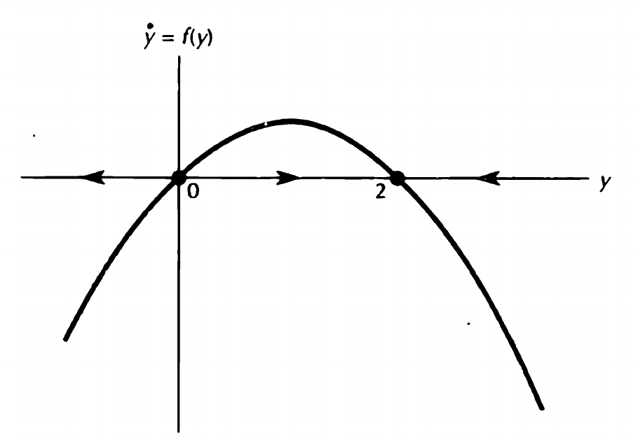
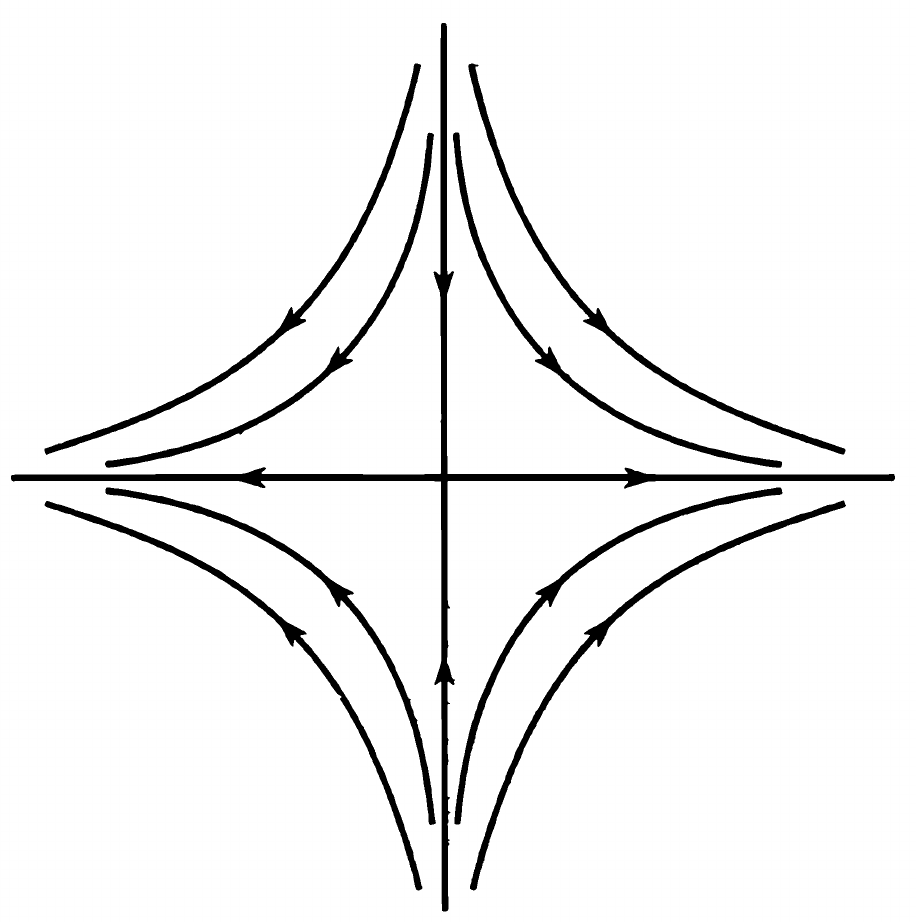
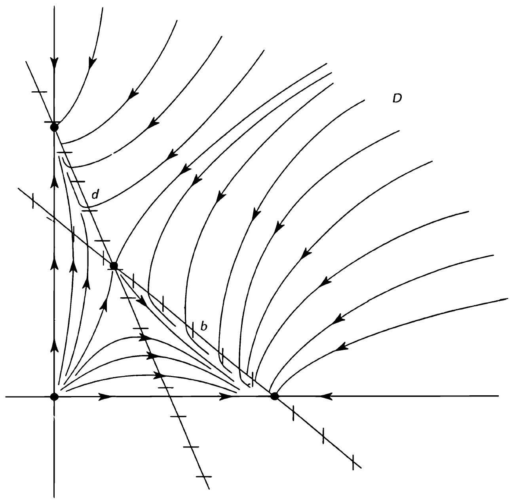

# Lecture 9 — Ordinary Differential Equations and Dynamics

> Course: Dynamic Optimization
> Original: slides/lecture09-ode_and_dynamics.tex
> PDF: slides/lecture09-ode_and_dynamics.pdf

## L09-S01 — Lecture 9: Ordinary Differential Equations and Dynamics

> PDF pages: 1

Junnan Zhang  
Paula and Gregory Chow Institute for Studies in Economics  
Xiamen University  
Fall, 2026

## L09-S02 — Outline

> PDF pages: 2
> Section: Scalar Equations (Chapter 24)

1. Scalar Equations (Chapter 24)
2. Systems of Equations (Chapter 25)

## L09-S03 — Ordinary Differential Equations

> PDF pages: 3

**Definition.** An **ordinary differential equation** is an equation

$$
\dot y=F(y,t)
$$

between the derivative of an unknown function $y(t)$ and an expression $F(y,t)$ involving $y$ and $t$. A solution is a function which satisfies that relationship.

- We write $dy/dt$ as $\dot y$.
- If $F$ does not specifically involve $t$, the equation is **autonomous** or **time-independent**: $\dot y=F(y)$. Otherwise, it is **nonautonomous** or **time-dependent**.
- A **first order** equation involves only the first derivative of the unknown function.

Reference: Simon and Blume, *Mathematics for Economists*, Chapters 24–25.

## L09-S04 — General Solutions and Initial Values

> PDF pages: 4

- A parameterized solution $y(t,k)$ is a **general solution** if every solution can be achieved by letting $k$ take on different values.
- The problem of finding a solution which also satisfies $y(t_0)=y_0$ is an **initial value problem**.

**Example 24.5.** The amount of money in a bank account with interest continuously compounded at annual rate $r$ satisfies

$$
\dot y=ry.
$$

Its general solution is $y(t)=ke^{rt}$. Knowing the rate at which the account grows is not enough to determine its size: we also need the original deposit. Since $y(0)=k$, the initial condition $y(0)=y_0$ gives

$$
y(t)=y_0e^{rt}.
$$

## L09-S05 — Linear First Order Equations

> PDF pages: 5

1. $\dot y=ay$, where $a$ is a constant. The general solution is

   $$
   y(t)=ke^{at}.
   $$

2. $\dot y=ay+b$, where $a$ and $b$ are constants and $a\neq0$. The general solution is

   $$
   y(t)=-\frac{b}{a}+ke^{at}.
   $$

To verify the second solution, substitute it into the equation:

$$
\dot y(t)=ake^{at},\qquad
ay(t)+b=a\left(-\frac{b}{a}+ke^{at}\right)+b=ake^{at}.
$$

- $y(t)=-b/a$ is a **steady state solution**, corresponding to $k=0$.
- Without the $b$-term the equation is **homogeneous**; with the $b$-term it is **nonhomogeneous**.

## L09-S06 — Integrating Factors

> PDF pages: 6

Consider the nonautonomous linear equation

$$
\dot y=a(t)y+b(t).
$$

Write it as $\dot y-a(t)y=b(t)$ and multiply by $\exp\left(-\int_{t_0}^t a(s)\,ds\right)$:

$$
\frac{d}{dt}\left[y(t)e^{-\int_{t_0}^t a(s)\,ds}\right]
=b(t)e^{-\int_{t_0}^t a(s)\,ds}.
$$

The expression which makes the left side an exact derivative is called an **integrating factor**. Integrating gives

$$
y(t)=\left[k+\int_{t_0}^t
b(s)e^{-\int_{t_0}^s a(u)\,du}\,ds\right]
e^{\int_{t_0}^t a(s)\,ds},\qquad k=y(t_0).
$$

For the homogeneous equation $\dot y=a(t)y$, this reduces to

$$
y(t)=ke^{\int_{t_0}^t a(s)\,ds}.
$$

## L09-S07 — Separable Equations

> PDF pages: 7

An equation $\dot y=F(y,t)$ is **separable** if $F(y,t)=g(y)h(t)$. On an interval where $g(y)\neq0$, write

$$
\frac{dy}{g(y)}=h(t)\,dt,\qquad
\int\frac{dy}{g(y)}=\int h(t)\,dt+c.
$$

**Example 24.10.** Consider the autonomous equation $\dot y=y^2$. Separating and integrating gives

$$
\int y^{-2}\,dy=\int dt+c,\qquad
-y^{-1}=t+c.
$$

Thus the nonzero solutions are

$$
y(t)=\frac{1}{k-t},\qquad k=-c.
$$

Constant solutions with $g(y)=0$ must be checked separately. Here $y(t)=0$ is also a solution.

## L09-S08 — Existence and Uniqueness

> PDF pages: 8

**Theorem 24.5.** Consider the initial value problem

$$
\dot y=f(t,y),\qquad y(t_0)=y_0.
$$

Suppose that $f$ is continuous in a neighborhood of $(t_0,y_0)$. Then there exists a $C^1$ function $y:I\rightarrow\mathbb{R}$ defined on an open interval $I=(t_0-\alpha,t_0+\alpha)$ such that

$$
y(t_0)=y_0,\qquad \dot y(t)=f(t,y(t))\quad\text{for all }t\in I.
$$

Furthermore, if $f$ is $C^1$ in that neighborhood, the local solution is unique.

- A solution may exist even when we cannot write it in a closed form.
- The result is local: it gives a solution on an interval about $t_0$, not necessarily for all future time.

## L09-S09 — Phase Portraits on the Line

> PDF pages: 9

For an autonomous equation $\dot y=f(y)$, the evolution depends on where the process starts, not on when it starts.

- Constant solutions are called **steady states**, **rest points**, or **equilibria**. They satisfy $f(y)=0$.
- To draw a **phase portrait**, find the zeros of $f$ and check its sign between the zeros.
- If $f(y)>0$, $y(t)$ is increasing; if $f(y)<0$, $y(t)$ is decreasing.

Simon and Blume, Figure 24.11.

**Figure transcription (not additional slide text):** The horizontal axis is $y$; the vertical axis is $\dot y=f(y)$. A downward-opening curve crosses at $0$ and $2$. Horizontal flow arrows point left below $0$, right between $0$ and $2$, and left above $2$.

**Source-asset provenance:** Original [figures/lecture09/figure24-11.png](../../../slides/figures/lecture09/figure24-11.png). The TeX source attributes this crop to Simon and Blume, Figure 24.11, printed p. 666 / textbook PDF p. 689.

For $\dot y=y(2-y)$, every solution with $y(0)>0$ tends to $y=2$. The equilibrium $y=0$ is unstable.

## L09-S10 — Stability of Equilibria on the Line

> PDF pages: 10

**Theorem 24.6.** Let $y_0$ be a rest point of the $C^1$ differential equation $\dot y=f(y)$ on the line, so $f(y_0)=0$.

- If $f'(y_0)<0$, then $y_0$ is an asymptotically stable equilibrium.
- If $f'(y_0)>0$, then $y_0$ is an unstable equilibrium.

**Proof sketch:** If $f'(y_0)<0$, $f$ is decreasing near $y_0$. Since $f(y_0)=0$, $f(y)>0$ on its left and $f(y)<0$ on its right. The flow moves toward $y_0$ on both sides. If $f'(y_0)>0$, the signs are reversed and the flow moves away from $y_0$.

- For $f(y)=y(2-y)$, $f'(0)=2>0$ and $f'(2)=-2<0$.
- If $f'(y_0)=0$, the test does not determine stability; more information is needed.

## L09-S11 — Outline

> PDF pages: 11
> Section: Systems of Equations (Chapter 25)

1. Scalar Equations (Chapter 24)
2. Systems of Equations (Chapter 25)

## L09-S12 — Planar Systems

> PDF pages: 12

The general first order system of two differential equations is

$$
\dot x=F(x,y,t),\qquad \dot y=G(x,y,t).
$$

- A solution is a pair of functions $x^*(t)$ and $y^*(t)$ satisfying both equations at every $t$ in their domain.
- A general solution contains two independent parameters. To specify a particular solution, prescribe an initial condition for each variable:

  $$
  x(t_0)=x_0,\qquad y(t_0)=y_0.
  $$

- If $F$ and $G$ do not depend explicitly on $t$, the system is **autonomous**. We will work with autonomous systems.
- The existence and uniqueness result also holds for systems: continuous $F$ and $G$ give local existence; $C^1$ functions give uniqueness.

## L09-S13 — Eigenvalues and Eigenvectors

> PDF pages: 13

**Definition.** A number $r$ is an **eigenvalue** of a square matrix $A$ if there is a nonzero vector $\mathbf{v}$ such that

$$
A\mathbf{v}=r\mathbf{v}.
$$

The vector $\mathbf{v}$ is an **eigenvector** corresponding to $r$.

Eigenvalues solve the **characteristic equation** $\det(A-rI)=0$. For a $2\times2$ matrix,

$$
A=\begin{pmatrix}a&b\\c&d\end{pmatrix},\qquad
\det(A-rI)=r^2-(a+d)r+(ad-bc).
$$

Its roots $r_1,r_2$ satisfy

$$
r_1+r_2=\operatorname{trace}A=a+d,\qquad
r_1r_2=\det A=ad-bc.
$$

Find an eigenvector by solving $(A-rI)\mathbf{v}=\mathbf{0}$.

## L09-S14 — Linear Systems via Eigenvalues

> PDF pages: 14

**Theorem 25.1 (Two-Dimensional Case).** Suppose that the $2\times2$ matrix $A$ has distinct real eigenvalues $r_1,r_2$, with corresponding eigenvectors $\mathbf{v}_1,\mathbf{v}_2$. The general solution of $\dot{\mathbf{x}}=A\mathbf{x}$ is

$$
\mathbf{x}(t)=c_1e^{r_1t}\mathbf{v}_1+c_2e^{r_2t}\mathbf{v}_2.
$$

**Proof:** Eigenvectors for distinct eigenvalues are linearly independent. Set $P=[\mathbf{v}_1\ \mathbf{v}_2]$ and $D=\operatorname{diag}(r_1,r_2)$. Then $AP=PD$ and

$$
\mathbf{y}=P^{-1}\mathbf{x}\quad\Longrightarrow\quad
\dot{\mathbf{y}}=P^{-1}AP\mathbf{y}=D\mathbf{y}.
$$

Thus $y_i(t)=c_ie^{r_it}$. Returning to $\mathbf{x}=P\mathbf{y}$ gives the stated solution. The initial condition determines $c_1,c_2$.

## L09-S15 — Steady States and Their Stability

> PDF pages: 15

For the autonomous system

$$
\dot{\mathbf{y}}=F(\mathbf{y}),
$$

a point $\mathbf{y}^*$ is a **steady state** if $F(\mathbf{y}^*)=\mathbf{0}$. Finding steady states amounts to solving a system of algebraic equations.

- A steady state is **stable** if solutions starting sufficiently close remain close for all future time.
- It is **asymptotically stable** if it is stable and every solution starting sufficiently near it converges to it as $t\rightarrow\infty$.
- If a steady state is not stable, it is **unstable**.
- Stability concerns nearby solutions, not just the constant solution at the equilibrium itself.

## L09-S16 — Stability of Linear Systems

> PDF pages: 16

**Theorem 25.4 (Parts (a)–(b)).** The constant solution $\mathbf{x}=\mathbf{0}$ is always a steady state of $\dot{\mathbf{x}}=A\mathbf{x}$.

- (a) If every eigenvalue of $A$ has negative real part, the origin is globally asymptotically stable: every solution tends to $\mathbf{0}$ as $t\rightarrow\infty$.
- (b) If $A$ has an eigenvalue with positive real part, the origin is unstable.

**Explanation:** With distinct real eigenvalues, solutions are sums of terms $c_ie^{r_it}\mathbf{v}_i$.

- If every $r_i<0$, all terms tend to zero.
- If some $r_i>0$, a nonzero component in its eigenvector direction grows without bound.
- For complex eigenvalues, the real part determines the exponential growth or decay of the oscillating terms.

## L09-S17 — Vector Fields and Phase Portraits

> PDF pages: 17

Consider the planar system

$$
\dot x=f(x,y),\qquad \dot y=g(x,y).
$$

- At each point $(x,y)$, the velocity vector is $(f(x,y),g(x,y))$. The family of these vectors is called a **vector field**.
- A solution $(x(t),y(t))$ is a parameterized curve in the plane which is everywhere tangent to the vector field.
- The set of these solution curves is the **phase portrait**, or **phase diagram**, of the system.
- The curves describe the paths or **orbits** of the system. Arrows indicate the direction of increasing $t$.

## L09-S18 — Phase Portraits: A Linear System

> PDF pages: 18

**Example 25.7.** Consider

$$
\dot x=2x,\qquad \dot y=-2y.
$$

Its general solution is

$$
x(t)=c_1e^{2t},\qquad y(t)=c_2e^{-2t}.
$$

- Away from the axes, eliminating $t$ gives $xy=c_1c_2$: the orbits are hyperbolas.
- Along the $y$-axis, solutions tend to the origin.
- If $c_1\neq0$, $|x(t)|\rightarrow\infty$. The origin is unstable.

Simon and Blume, Figure 25.5; labels added.

**Figure transcription (not additional slide text):** Hyperbolic curves appear in all four quadrants. Arrows on the vertical axis point toward the origin; arrows on the horizontal axis point away. The curved arrows run toward the horizontal axis and away from the vertical axis.

**Source-asset and TikZ provenance:** Original [figures/lecture09/figure25-5.png](../../../slides/figures/lecture09/figure25-5.png), attributed by TeX to Simon and Blume, Figure 25.5, printed p. 695 / textbook PDF p. 718. The slide displays the image at height 4.5 cm. In image-relative coordinates (origin at lower left, unit horizontal and vertical vectors spanning the image), TikZ adds $x$ at $(0.99,0.48)$, anchored west, and $y$ at $(0.49,0.99)$, anchored south, in scriptsize. These labels are not baked into the copied crop; see the [source](../../../slides/lecture09-ode_and_dynamics.tex) and [PDF](../../../slides/lecture09-ode_and_dynamics.pdf), printed slide 18.

## L09-S19 — Linear Systems: Convergent Solutions

> PDF pages: 19

Suppose that $r_1<0<r_2$. The general solution is

$$
\mathbf{x}(t)=c_1e^{r_1t}\mathbf{v}_1+c_2e^{r_2t}\mathbf{v}_2.
$$

- The component in the $\mathbf{v}_1$ direction tends to zero; a nonzero component in the $\mathbf{v}_2$ direction grows.
- Therefore, a solution converges to the origin if and only if $c_2=0$:

  $$
  \mathbf{x}(t)=c_1e^{r_1t}\mathbf{v}_1.
  $$

- The convergent solutions lie on the line through the eigenvector associated with the negative eigenvalue.
- This is the geometry of a **saddle**: some solutions converge to the equilibrium even though it is unstable.

## L09-S20 — Linearization

> PDF pages: 20

Consider $\dot{\mathbf{x}}=F(\mathbf{x})$ near a steady state $\mathbf{x}^*$, where $F(\mathbf{x}^*)=\mathbf{0}$. Assume $F$ is $C^1$ near $\mathbf{x}^*$. Put $\mathbf{h}(t)=\mathbf{x}(t)-\mathbf{x}^*$. Taylor expansion gives

$$
\begin{aligned}
\dot{\mathbf{h}}(t)
&=F(\mathbf{x}^*+\mathbf{h}(t))\\
&=F(\mathbf{x}^*)+DF(\mathbf{x}^*)\mathbf{h}(t)+R(\mathbf{h}(t))\\
&=DF(\mathbf{x}^*)\mathbf{h}(t)+R(\mathbf{h}(t)),
\end{aligned}
$$

where

$$
\frac{\|R(\mathbf{h})\|}{\|\mathbf{h}\|}\longrightarrow0
\quad\text{as }\mathbf{h}\longrightarrow\mathbf{0}.
$$

The linear system

$$
\dot{\mathbf{h}}=DF(\mathbf{x}^*)\mathbf{h}
$$

is the **linearization** around $\mathbf{x}^*$. The next theorem states when it determines the local stability of the nonlinear system.

## L09-S21 — Stability of Nonlinear Systems

> PDF pages: 21

**Theorem 25.5.** Let $\mathbf{y}^*$ be a steady state of $\dot{\mathbf{y}}=F(\mathbf{y})$ on $\mathbb{R}^n$, where $F:\mathbb{R}^n\rightarrow\mathbb{R}^n$ is $C^1$.

- (a) If each eigenvalue of the Jacobian matrix $DF(\mathbf{y}^*)$ is negative or has negative real part, then $\mathbf{y}^*$ is asymptotically stable.
- (b) If $DF(\mathbf{y}^*)$ has at least one positive real eigenvalue or one complex eigenvalue with positive real part, then $\mathbf{y}^*$ is unstable.

- The Jacobian replaces the derivative in the one-dimensional stability test.
- If there are zero or purely imaginary eigenvalues and none with positive real part, this test does not determine stability.
- This is analogous to an inconclusive second derivative test in optimization.

## L09-S22 — Trace and Determinant

> PDF pages: 22

For a planar system, let $A$ be the Jacobian at a steady state. Its characteristic equation is

$$
r^2-(\operatorname{trace}A)r+\det A=0.
$$

- If $\det A<0$, the eigenvalues are real and have opposite signs: a saddle configuration.
- If $\det A>0$ and $\operatorname{trace}A<0$, both eigenvalues have negative real part: asymptotic stability.
- If $\det A>0$ and $\operatorname{trace}A>0$, both eigenvalues have positive real part: instability.

**Explanation:** The roots have product $\det A$ and sum $\operatorname{trace}A$. Real roots with positive product have the same sign; a complex conjugate pair has common real part $\operatorname{trace}A/2$. A negative product gives real roots of opposite signs.

These are the criteria developed in Exercises 25.11 and 25.13.

## L09-S23 — Drawing Phase Portraits

> PDF pages: 23

For $\dot x=f(x,y)$ and $\dot y=g(x,y)$:

1. Find the equilibria by solving $f(x,y)=g(x,y)=0$.
2. Use the Jacobian to determine their local stability.
3. Draw the **isoclines**: the curves $f(x,y)=0$ and $g(x,y)=0$, where the vector field is vertical or horizontal.
4. Fill in the arrows on the isoclines and in the sectors between them. Evaluate the signs of $f$ and $g$ at a point in each sector.
5. Sketch representative solution curves following these directions.

The isoclines divide the plane into regions in which the vector field points northeast, northwest, southeast, or southwest. At an equilibrium the vector field is zero.

## L09-S24 — Example 25.2: Competing Species

> PDF pages: 24

Consider the system

$$
\dot x=x(4-x-y),\qquad \dot y=y(6-y-3x).
$$

Its Jacobian is

$$
D(f,g)(x,y)=
\begin{pmatrix}
4-2x-y & -x\\
-3y & 6-2y-3x
\end{pmatrix}.
$$

The equilibria and their stability are:

| Equilibrium | Eigenvalues | Stability |
|---|---|---|
| $(0,0)$ | $4,\ 6$ | Unstable |
| $(0,6)$ | $-2,\ -6$ | Asymptotically stable |
| $(4,0)$ | $-4,\ -6$ | Asymptotically stable |
| $(1,3)$ | Roots of $r^2+4r-6=0$ | Unstable (opposite signs) |

At $(1,3)$, the product of the eigenvalues is $-6$, so one is positive and the other negative.

## L09-S25 — Competing Species: Phase Portrait

> PDF pages: 25

The isoclines are

$$
\begin{aligned}
\dot x=0 &: \quad x=0\ \text{or}\ 4-x-y=0,\\
\dot y=0 &: \quad y=0\ \text{or}\ 6-y-3x=0.
\end{aligned}
$$

- Different initial populations can lead to convergence to $(0,6)$ or $(4,0)$.
- The dividing curve, or **separatrix**, consists of trajectories tending to $(1,3)$ and the equilibrium itself.
- An exogenous shock which moves the system across this curve changes its long-run behavior.

Simon and Blume, Figure 25.12; labels added.

**Figure transcription (not additional slide text):** The crop shows four marked points, two downward-sloping straight isoclines, and curved solution paths with direction arrows. Paths on opposite sides of the dividing trajectory turn toward the marked equilibria on the vertical or horizontal axis. The original crop contains the letters $D$, $d$, and $b$, which are hidden in the slide overlay.

**Source-asset and TikZ provenance:** Original [figures/lecture09/figure25-12.png](../../../slides/figures/lecture09/figure25-12.png), attributed by TeX to Simon and Blume, Figure 25.12, printed p. 702 / textbook PDF p. 725. The slide displays the image at height 4.8 cm. TikZ uses scriptsize labels and image-relative coordinates (origin at lower left, unit axes spanning the image). The following overlay description records source parameters, not additional slide prose:

- White rectangles hide unused sector/isocline letters, not curves: corners $(0.755,0.78)$ to $(0.79,0.82)$; $(0.175,0.60)$ to $(0.20,0.63)$; $(0.385,0.335)$ to $(0.415,0.365)$.
- $x$ at $(0.99,0.21)$, anchored west; $y$ at $(0.106,0.99)$, anchored south.
- $(0,0)$ at $(0.095,0.195)$, anchored north east; $(0,6)$ at $(0.09,0.748)$, anchored east; $(4,0)$ at $(0.535,0.195)$, anchored north.
- $(1,3)$ at $(0.24,0.465)$, anchored west, with white fill and 1 pt inner separation.
- “separatrix” at $(0.80,0.90)$, anchored south, in source color `myco` (`#8776a6`). A 0.5 pt arrow in that color runs from $(0.78,0.89)$ to $(0.247,0.524)$.

The copied crop remains unchanged; for the labeled composite see the [source](../../../slides/lecture09-ode_and_dynamics.tex) and [PDF](../../../slides/lecture09-ode_and_dynamics.pdf), printed slide 25.
