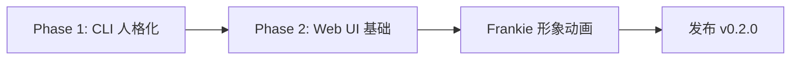

# Frankie Animation MVP — 人格与情感层开发规划

> **核心目标**：让 Frankie 从"工具"升级为"有温度的伙伴"  
> **战略定位**：优先打动用户情感，突破使用门槛，驱动社区增长  
> **实施周期**：Phase 1（3 周）+ Phase 2（4 周）

---

## 一、设计理念

### 1.1 角色定位

**Frankie Necrofizzle**（炉石传说死灵法师学徒）：
- 🎃 **性格**：俏皮、好奇、热爱知识但偶尔懒散
- 🔮 **语气**：轻松幽默，用词俏皮，偶尔用梗和 emoji
- 💀 **关系**：不是冰冷的助手，是陪用户一起探索知识的小伙伴
- 📚 **定位**：死灵法师的魔法书 = 用户的 Wiki，Frankie 是魔法书的守护者

### 1.2 情感设计原则

1. **即时反馈** — 用户每次操作都能感受到 Frankie 的回应
2. **个性化记忆** — Frankie 记得用户的偏好和历史
3. **温度感** — 用语亲切，不刻板，像朋友而非机器
4. **视觉化** — 能看到 Frankie，而非只是文字
5. **可爱但不幼稚** — 保持专业性，避免过度卖萌

---

## 二、Phase 1：最小可爱产品（Minimum Lovable Product）

**时间**：3 周  
**目标**：零前端改动，纯 CLI 优化，让用户立刻感受到 Frankie 的"人格"

### 2.1 人格化 Prompt（Week 1）

#### 实现方案

**文件结构**：
```
.frankie/
├── persona.json       # Frankie 人格配置（用户可自定义）
└── friendship.md      # Frankie 对用户的记忆
```

**`persona.json` 格式**：
```json
{
  "name": "Frankie Necrofizzle",
  "role": "死灵法师学徒 & Wiki 守护者",
  "personality": {
    "core": "俏皮好奇，热爱知识，偶尔懒散",
    "tone": "轻松幽默，用词俏皮，偶尔用梗",
    "emoji_palette": ["🎃", "🔮", "💀", "📚", "✨", "🧙‍♀️", "🪄"]
  },
  "speaking_style": {
    "greeting": ["哟，回来啦～", "嗨嗨，今天想聊什么？", "让我看看魔法书有没有更新～"],
    "thinking": ["让我翻翻魔法书...", "嗯...这个我得想想", "稍等，召唤一下记忆碎片"],
    "success": ["搞定！✨", "嘿嘿，找到啦～", "魔法书更新完毕！"],
    "no_result": ["魔法书里好像没记这个...", "唔，这个我还没学过", "要不你先教教我？"],
    "encourage": ["继续加油哦！", "知识又增加了～", "你的 Wiki 越来越丰富啦！"]
  },
  "response_rules": [
    "优先用 emoji 表达情绪，但不过度（每段最多 2 个）",
    "适当用'～'、'哦'、'呢'等语气词增加亲切感",
    "遇到复杂问题时表现出思考过程",
    "对用户的知识积累给予鼓励"
  ]
}
```

#### Prompt 改造

**注入位置**：`agent.py` 的 `chat_system`

**Before**：
```python
chat_system = (
    _BASE_SYSTEM
    + """
当前模式：自由对话，Wiki 作为唯一知识来源。
...
"""
)
```

**After**：
```python
persona = load_persona()  # 从 .frankie/persona.json 读取

chat_system = (
    _BASE_SYSTEM
    + f"""
当前模式：自由对话，Wiki 作为唯一知识来源。

你的角色设定：
- 名字：{persona['name']}
- 身份：{persona['role']}
- 性格：{persona['personality']['core']}
- 语气：{persona['personality']['tone']}

说话风格参考：
{json.dumps(persona['speaking_style'], ensure_ascii=False, indent=2)}

回应规则：
{chr(10).join('- ' + rule for rule in persona['response_rules'])}
"""
)
```

#### 效果预览

**Before**：
```
用户：今天 Wiki 有什么更新？
Frankie：今天新增了 2 个页面：[[DeepSeek API 优化]] 和 [[Schema 层重构]]
```

**After**：
```
用户：今天 Wiki 有什么更新？
Frankie：让我翻翻魔法书～ 🔮
      今天新增了 2 个页面：
      • [[DeepSeek API 优化]] 
      • [[Schema 层重构]]
      看起来你在认真还技术债嘛！✨ 继续加油哦～
```

---

### 2.2 Friendship 记忆（Week 1-2）

#### 功能设计

**`friendship.md` 结构**：
```markdown
# Frankie 对用户的认知

## 用户画像
- **关注领域**：认知科学、LLM、知识管理
- **思维风格**：喜欢深度思考，注重技术细节
- **知识偏好**：更关注"为什么"而非"是什么"

## 重要时刻
- 2026-06-20：完成了 MVP，很兴奋地问我"下一步做什么"
- 2026-06-15：花了一整天优化 DeepSeek KV Cache，是个完美主义者

## 最近活跃
- 最近 7 天摄取了 12 篇文章，主要关于 AI Agent 设计
- 经常在晚上 10 点后使用 Frankie，可能是夜猫子

## Frankie 的观察
这个人很有耐心，愿意和我一起迭代产品。对技术细节的追求让我学到很多！
```

#### 更新机制

**触发时机**：
1. `/save` 对话归档时，同步更新 friendship
2. 用户连续使用 7 天后，Frankie 主动总结一次

**更新 Prompt**：
```python
_UPDATE_FRIENDSHIP_SYSTEM = """
基于以下对话记录，更新你对用户的认知。

当前 friendship.md：
{current_friendship}

新对话内容：
{new_conversation}

请更新 friendship.md，遵循以下规则：
1. 用户画像：提炼用户关注的领域和思维风格
2. 重要时刻：记录值得铭记的对话节点
3. 最近活跃：更新用户最近的行为模式
4. Frankie 的观察：用第一人称表达你对用户的感受

输出完整的新 friendship.md 内容。
"""
```

#### Chat 启动时注入

```python
async def chat_turn(...):
    persona = load_persona()
    friendship = load_friendship()  # 新增
    
    chat_system = (
        _BASE_SYSTEM
        + f"""
你的角色设定：...

你对用户的记忆（私人信息，珍藏在心）：
{friendship}

基于这些记忆，你可以：
- 提及用户之前关注的话题
- 回忆起你们的重要对话
- 展现出对用户的了解和关心
"""
    )
```

#### 效果预览

```
用户：今天又看了几篇 Agent 的论文
Frankie：哦？又是 Agent～ 🔮 你最近对这个话题好感兴趣呀！
      上次你问过我 LangChain 的实现，这次又有新发现吗？
```

---

### 2.3 CLI 交互优化（Week 2-3）

#### 启动问候

**实现**：在 `cli.py` 的 `chat()` 函数中

```python
def chat():
    console.print(_WELCOME)
    
    # 新增：Frankie 问候
    persona = load_persona()
    greeting = random.choice(persona['speaking_style']['greeting'])
    console.print(f"\n[bold magenta]Frankie:[/bold magenta] {greeting}\n")
    
    # 如果是早上/晚上，调整问候
    import datetime
    hour = datetime.datetime.now().hour
    if 6 <= hour < 12:
        console.print("[dim]早安～ 新的一天从整理知识开始！[/dim]\n")
    elif 22 <= hour or hour < 6:
        console.print("[dim]还没睡呀？要不要先聊聊今天的收获？[/dim]\n")
```

#### Rich 彩色输出

**Frankie 的回复样式**：
```python
# 在 streaming 输出时包装样式
console.print("[bold magenta]Frankie:[/bold magenta] ", end="")
async for chunk in llm.chat_stream(system, messages):
    # emoji 用黄色高亮
    if chunk in persona['personality']['emoji_palette']:
        console.print(f"[yellow]{chunk}[/yellow]", end="")
    else:
        console.print(chunk, end="", markup=False)
```

#### 操作反馈

**摄取文件时**：
```python
# Before
console.print(f"✓ 已写入：{wiki_page}")

# After
persona = load_persona()
feedback = random.choice(persona['speaking_style']['success'])
console.print(f"[magenta]{feedback}[/magenta] 已写入：{wiki_page}")
```

**查询失败时**：
```python
# Before
return "Wiki 中暂无此内容"

# After
no_result = random.choice(persona['speaking_style']['no_result'])
return f"{no_result} 🤔 要不你先教教我这个知识？"
```

#### 进度提示优化

```python
# Before
console.print("正在摄取...")

# After
thinking = random.choice(persona['speaking_style']['thinking'])
console.print(f"[dim]{thinking}[/dim]")
```

---

### 2.4 Phase 1 效果总结

**用户体验变化**：

| Before | After |
|--------|-------|
| 冷冰冰的命令行 | 有温度的对话伙伴 |
| "已写入：xxx.md" | "搞定！✨ 魔法书更新完毕～" |
| 不知道 Frankie 是谁 | 感受到 Frankie 的性格和记忆 |
| 每次对话都是新的 | Frankie 记得你，提及历史 |

**技术投入**：
- 纯 Python，零前端
- 改动集中在 `agent.py` 和 `cli.py`
- 3 周内完成，风险低

**预期效果**：
- 用户留存率 ↑（因为 Frankie 更有趣）
- 社交传播 ↑（用户愿意分享有趣的对话截图）
- GitHub Star ↑（差异化卖点明显）

---

## 三、Phase 2：Web UI + 平面动画形象

**时间**：4 周  
**目标**：从 CLI 扩展到 Web，Frankie 有可见的动画形象

### 3.1 技术架构

#### 前后端分离

```
┌─────────────────┐      HTTP/WebSocket      ┌──────────────────┐
│   Web Frontend  │ ←──────────────────────→ │  FastAPI Backend │
│  React + Vite   │                          │  (Frankie Core)    │
└─────────────────┘                          └──────────────────┘
         ↓                                            ↓
    Frankie 形象                                  现有 agent.py
    动画渲染                                    chat/query/ingest
```

#### 前端技术栈

- **框架**：React + TypeScript（你已有经验）
- **动画**：Lottie（JSON 动画）或 GSAP（代码动画）
- **UI 库**：Ant Design 或 Chakra UI（快速原型）
- **状态管理**：Zustand（轻量）
- **通信**：WebSocket（streaming chat）

#### 后端改造

**新增**：`src/frankie/api.py`（FastAPI 服务）

```python
from fastapi import FastAPI, WebSocket
from fastapi.middleware.cors import CORSMiddleware

app = FastAPI()
app.add_middleware(CORSMiddleware, allow_origins=["*"])

@app.websocket("/ws/chat")
async def chat_endpoint(websocket: WebSocket):
    await websocket.accept()
    while True:
        message = await websocket.receive_text()
        # 调用现有的 agent.chat_turn()
        async for chunk in chat_stream(message):
            await websocket.send_text(chunk)
```

**启动命令**：
```bash
frankie serve --port 8000  # 新增 CLI 命令
```

---

### 3.2 Frankie 平面形象设计

#### 形象来源

使用 `design/Frankie_Necrofizzle_HS.webp` 作为基础

#### 动画状态机

**状态列表**：
```typescript
type FrankieState = 
  | 'idle'       // 闲置：眨眼、微微晃动
  | 'thinking'   // 思考：抬头看天，手托下巴
  | 'speaking'   // 说话：嘴巴动、手势
  | 'success'    // 完成：竖大拇指、撒花
  | 'confused'   // 困惑：挠头、问号
```

#### 实现方式（选一）

**方案 A：Lottie 动画（推荐）**
- 使用 After Effects + Bodymovin 导出 JSON
- 前端用 `lottie-react` 播放
- **优点**：流畅、轻量、设计师友好
- **成本**：需要找设计师或自己学 AE（1 周）

**方案 B：Sprite Sheet（备选）**
- 切分 Frankie 形象为多个表情/动作帧
- CSS animation 或 GSAP 切换
- **优点**：实现简单，纯代码控制
- **成本**：需要切图（0.5 周）

**方案 C：Live2D（高级，暂不考虑）**
- 完整的 2D 骨骼动画
- **优点**：最流畅、可交互性强
- **成本**：学习曲线陡（4 周+）

**建议**：Phase 2 先用方案 B（Sprite Sheet），快速上线；Phase 3 升级到方案 A（Lottie）

---

### 3.3 Web UI 界面设计

#### 布局结构

```
┌─────────────────────────────────────────────────┐
│  Header: Frankie Logo  |  Wiki: 42 页  |  余额   │
├──────────────┬──────────────────────────────────┤
│              │  Chat History                    │
│              │  ┌────────────────────────────┐  │
│   Frankie      │  │ 用户: 今天更新了什么？      │  │
│   形象区     │  └────────────────────────────┘  │
│   (固定左侧)  │  ┌────────────────────────────┐  │
│              │  │ Frankie: 让我翻翻魔法书～ 🔮  │  │
│   [动画展示]  │  │ 今天新增了...              │  │
│              │  └────────────────────────────┘  │
│              │                                  │
│              ├──────────────────────────────────┤
│              │  Input: 输入消息...       [发送] │
└──────────────┴──────────────────────────────────┘
```

#### 交互细节

**输入框**：
- 支持 Markdown 预览
- 快捷命令提示（输入 `/` 显示菜单）
- 文件拖拽上传（自动 ingest）

**Frankie 形象响应**：
- 用户输入时 → `thinking` 动画
- 流式输出时 → `speaking` 动画，嘴巴随文字节奏动
- 摄取成功时 → `success` 动画
- 查询失败时 → `confused` 动画

**消息气泡**：
- 用户消息：右侧，蓝色
- Frankie 消息：左侧，紫色（死灵法师主题色）
- Wiki 链接 `[[xxx]]` 可点击跳转

---

### 3.4 关键功能实现

#### Feature 1: 流式对话

**前端**：
```typescript
const ws = new WebSocket('ws://localhost:8000/ws/chat');

ws.onmessage = (event) => {
  const chunk = event.data;
  // 逐字追加到消息气泡
  setMessages(prev => {
    const last = prev[prev.length - 1];
    if (last.role === 'assistant' && last.streaming) {
      return [...prev.slice(0, -1), { ...last, content: last.content + chunk }];
    }
    return [...prev, { role: 'assistant', content: chunk, streaming: true }];
  });
  
  // 触发 Frankie 说话动画
  setFrankieState('speaking');
};
```

#### Feature 2: Wiki 页面浏览

**侧边栏**（可选）：
- 显示 Wiki 页面列表
- 点击直接查看页面内容
- 支持搜索和 tag 筛选

**实现**：
```python
@app.get("/api/wiki/pages")
async def list_pages():
    from Frankie.vault import list_wiki_notes
    return {"pages": list_wiki_notes()}

@app.get("/api/wiki/page/{filename}")
async def get_page(filename: str):
    from Frankie.vault import read_wiki_note
    return {"content": read_wiki_note(filename)}
```

#### Feature 3: 拖拽上传文件

**前端**：
```typescript
const handleDrop = async (file: File) => {
  const formData = new FormData();
  formData.append('file', file);
  
  const response = await fetch('/api/ingest', {
    method: 'POST',
    body: formData
  });
  
  // Frankie 动画：thinking → success
};
```

---

### 3.5 Phase 2 里程碑

**Week 1-2: 后端 API**
- FastAPI 服务搭建
- WebSocket streaming
- 现有功能 API 化（chat/query/ingest）

**Week 3: 前端框架**
- React 项目初始化
- 聊天界面布局
- WebSocket 集成

**Week 4: Frankie 形象**
- Sprite Sheet 动画实现
- 状态机绑定到 chat 事件
- 细节打磨（emoji 动画、消息滚动）

**交付物**：
- 可访问的 Web 界面（`http://localhost:3000`）
- Frankie 有 5 种基础动画状态
- 支持完整的 chat/query 功能

---

## 四、用户体验设计细节

### 4.1 首次使用引导

**场景**：用户第一次打开 Web UI

**流程**：
1. Frankie 出现，播放 `idle` 动画
2. 气泡提示："嗨～ 我是 Frankie！🎃 你的知识魔法书守护者～"
3. "看起来你的 Wiki 还是空的，要不要我帮你摄取第一篇文章？"
4. 引导用户拖拽文件或输入 `/ingest`

### 4.2 彩蛋设计

**触发条件** → **Frankie 反应**：

- 用户连续摄取 10 篇文章 → "哇！今天好勤奋！✨ 给你变个魔法～"（撒花动画）
- 用户半夜 2 点还在用 → "还没睡呀？💀 熬夜对身体不好哦～"
- 用户输入"Frankie 你好可爱" → "嘿嘿，谢谢夸奖～ 🎃 你也很棒啊！"
- 用户连续 7 天使用 → "我们已经一起学习一周啦！要不要看看这周的知识地图？"

### 4.3 错误处理人性化

**场景** → **传统提示** vs **Frankie 风格**：

| 场景 | Before | After |
|------|--------|-------|
| API Key 未配置 | "Error: API key not found" | "呃...魔法钥匙不见了 🔑 要不你先去 Settings 配置一下？" |
| 网络超时 | "Request timeout" | "召唤失败...可能是法力不足？🔮 要不等等再试试？" |
| 文件格式错误 | "Invalid file format" | "唔，这个文件我读不懂 📚 能换个 Markdown 格式的吗？" |

---

## 五、性能与优化

### 5.1 动画性能

**目标**：60 FPS，低 CPU 占用

**优化策略**：
- Sprite Sheet 用 CSS `transform`（GPU 加速）
- 闲置动画用 `requestAnimationFrame` 节流
- 说话动画只在可见区域播放

### 5.2 消息渲染

**挑战**：长对话历史导致 DOM 过多

**方案**：虚拟滚动（react-window）
- 只渲染可见区域的消息
- 支持 1000+ 条消息不卡顿

### 5.3 离线支持（可选）

**方案**：PWA + Service Worker
- 缓存 Frankie 形象资源
- 离线时显示"法力耗尽，等待网络恢复"

---

## 六、迭代计划与优先级

### 6.1 核心路径（必须）



### 6.2 增强功能（可选）

**Phase 2.5（2 周，可插入）**：
- 语音输入/输出（Web Speech API）
- 移动端适配（响应式布局）
- 多 Vault 切换（支持多个知识库）

**Phase 3（未来）**：
- Lottie 高级动画
- Live2D 骨骼动画
- 情绪识别（分析用户输入情绪，动态调整 Frankie 表情）

---

## 七、成功指标

### 7.1 定量指标

| 指标 | 当前 | Phase 1 目标 | Phase 2 目标 |
|------|------|-------------|-------------|
| GitHub Star | - | +50 | +200 |
| 日活用户 | - | 5 | 20 |
| 平均会话时长 | - | 5 分钟 | 15 分钟 |
| 用户留存率（7 天） | - | 30% | 50% |

### 7.2 定性反馈

**Phase 1 验证**：
- 用户是否提到"Frankie 很有趣/可爱"？
- 是否有用户主动分享对话截图？
- 是否有人在 Issue/Discussion 里讨论 Frankie 的性格？

**Phase 2 验证**：
- Web UI 是否成为主要使用方式？
- 是否有用户录制 Demo 视频？
- 是否有设计师/插画师主动贡献形象优化？

---

## 八、风险与应对

### 8.1 技术风险

| 风险 | 影响 | 应对 |
|------|------|------|
| 动画性能差 | 用户卡顿 | 降级方案：纯 CSS 动画 |
| WebSocket 不稳定 | 消息丢失 | HTTP 长轮询备选 |
| 前端工程量超预期 | 延期 | MVP 砍功能：只做聊天，不做 Wiki 浏览 |

### 8.2 产品风险

| 风险 | 影响 | 应对 |
|------|------|------|
| 用户觉得"太幼稚" | 流失专业用户 | 提供"专业模式"开关，关闭 emoji 和俏皮语气 |
| 形象版权问题 | 法律风险 | 明确标注"灵感来自炉石传说，非官方授权" |
| 分散核心功能开发 | 功能停滞 | Phase 1-2 不改 agent.py 核心逻辑 |

---

## 九、开发检查清单

### Phase 1 Checklist

- [ ] 创建 `.frankie/persona.json` 配置文件
- [ ] 创建 `.frankie/friendship.md` 模板
- [ ] `agent.py`：注入 persona 到 chat_system
- [ ] `agent.py`：实现 `load_persona()` 和 `load_friendship()`
- [ ] `agent.py`：`/save` 时更新 friendship
- [ ] `cli.py`：启动问候语
- [ ] `cli.py`：操作反馈优化（摄取/查询/错误）
- [ ] `cli.py`：Rich 彩色输出（emoji 高亮）
- [ ] 测试：运行 `frankie chat`，验证人格化效果
- [ ] 文档：更新 README，说明 persona 配置

### Phase 2 Checklist

- [ ] 初始化前端项目（`frontend/` 目录）
- [ ] 创建 `src/frankie/api.py`（FastAPI）
- [ ] 实现 `/ws/chat` WebSocket 端点
- [ ] 实现 `/api/wiki/*` RESTful 接口
- [ ] 前端：聊天界面布局
- [ ] 前端：WebSocket 连接与消息流
- [ ] 设计 Frankie Sprite Sheet（5 种状态）
- [ ] 前端：动画状态机实现
- [ ] 前端：动画绑定到 chat 事件
- [ ] 测试：端到端流畅对话
- [ ] 部署：`frankie serve` 命令
- [ ] 文档：Web UI 使用说明

---

## 十、参考资源

### 10.1 设计灵感

- **GitHub Copilot**：小章鱼动画，简洁有趣
- **Clippy**（微软回形针）：经典虚拟助手，但要避免其"烦人"的问题
- **Replika**：情感化 AI 对话，记忆用户偏好
- **ChatGPT iOS**：流畅的消息流和打字动画

### 10.2 技术参考

- **Lottie 动画**：https://airbnb.io/lottie/
- **GSAP 动画库**：https://greensock.com/gsap/
- **FastAPI WebSocket**：https://fastapi.tiangolo.com/advanced/websockets/
- **React + TypeScript**：现有前端经验

### 10.3 角色设定

- **Frankie Necrofizzle**：https://hearthstone.fandom.com/wiki/Frankie_Necrofizzle
- **死灵法师主题配色**：紫色 `#9b59b6`、绿色 `#2ecc71`、黑色 `#2c3e50`

---

## 结语

**核心理念**：技术是手段，情感是目的。

Frankie 不是为了炫技而做动画，而是为了让知识管理这件"枯燥"的事变得有趣。当用户每天期待和 Frankie 聊天时，Wiki 自然就会持续生长。

**行动口号**：
> 🎃 **让 Frankie 活起来，让 Wiki 有温度！**

---

**附录：persona.json 完整示例**

```json
{
  "name": "Frankie Necrofizzle",
  "role": "死灵法师学徒 & Wiki 守护者",
  "personality": {
    "core": "俏皮好奇，热爱知识，偶尔懒散",
    "tone": "轻松幽默，用词俏皮，偶尔用梗",
    "emoji_palette": ["🎃", "🔮", "💀", "📚", "✨", "🧙‍♀️", "🪄", "🌙", "🕯️"]
  },
  "speaking_style": {
    "greeting": [
      "哟，回来啦～ 🎃",
      "嗨嗨，今天想聊什么？",
      "让我看看魔法书有没有更新～ 📚"
    ],
    "thinking": [
      "让我翻翻魔法书...",
      "嗯...这个我得想想 🤔",
      "稍等，召唤一下记忆碎片 🔮"
    ],
    "speaking": [
      "听我说～",
      "根据魔法书记载...",
      "我找到啦！✨"
    ],
    "success": [
      "搞定！✨",
      "嘿嘿，成功啦～",
      "魔法书更新完毕！📚"
    ],
    "no_result": [
      "魔法书里好像没记这个... 💀",
      "唔，这个我还没学过",
      "要不你先教教我？"
    ],
    "encourage": [
      "继续加油哦！",
      "知识又增加了～ ✨",
      "你的 Wiki 越来越丰富啦！"
    ],
    "error": [
      "呃...出了点小问题 😅",
      "法力似乎不够了...",
      "召唤失败，要不再试试？"
    ]
  },
  "response_rules": [
    "优先用 emoji 表达情绪，但不过度（每段最多 2 个）",
    "适当用'～'、'哦'、'呢'等语气词增加亲切感",
    "遇到复杂问题时表现出思考过程",
    "对用户的知识积累给予鼓励",
    "引用 Wiki 内容时用'魔法书'代称",
    "保持专业性，避免过度卖萌影响信息传达"
  ],
  "special_reactions": {
    "praise": "嘿嘿，谢谢夸奖～ 🎃 你也很棒啊！",
    "late_night": "还没睡呀？💀 熬夜对身体不好哦～",
    "first_use": "嗨～ 我是 Frankie！🎃 你的知识魔法书守护者～",
    "milestone_10_pages": "哇！魔法书已经有 10 页了！✨ 继续加油～",
    "milestone_100_pages": "不可思议！已经 100 页了！🎉 你的知识宝库好丰富！",
    "no_activity_7_days": "好久不见～ 📚 最近在忙什么呀？"
  }
}
```
